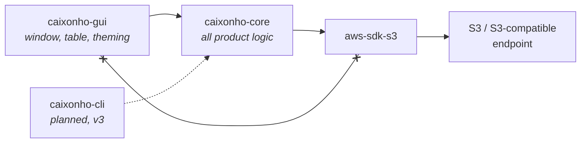
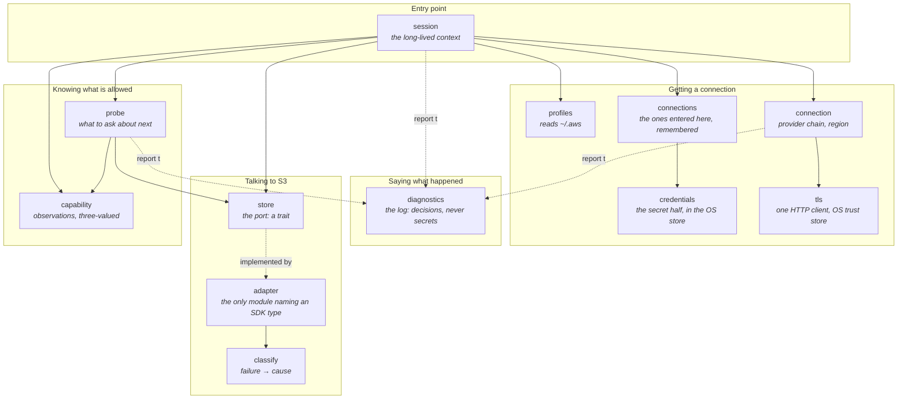
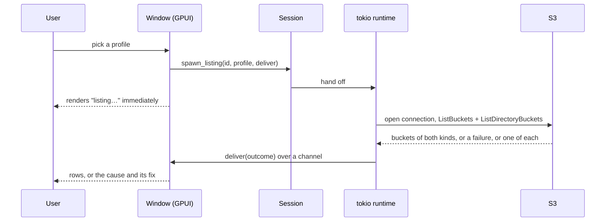
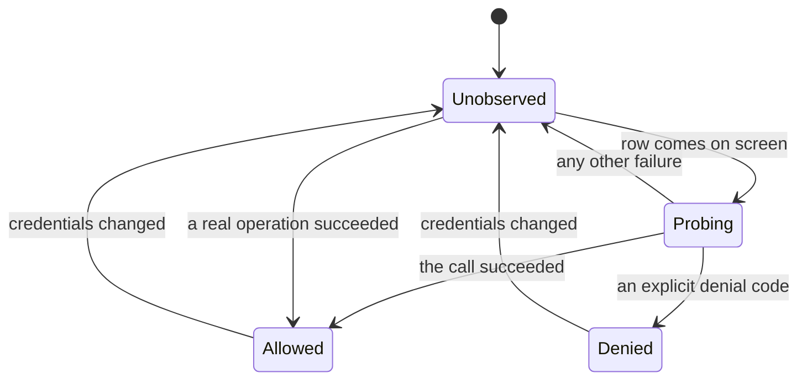

# Architecture

How the pieces fit and why they are separated that way. The rules here are
enforced — [`AGENTS.md`](../AGENTS.md) lists them as invariants, and breaking
one is a bug even when the code compiles.

## Two crates, one direction

`caixonho-core` owns every decision: which credentials to use, what a failure
means, what may be claimed about permissions, what to fetch and when. The
frontend renders and reports input.

The crossed line is the rule that keeps this honest: **the GUI never depends on
`aws-sdk-s3`.** When it needs to show something AWS-shaped, core re-exports a
domain type for it. Without that rule the UI slowly accumulates product logic
in the shape of SDK types, and the CLI that comes later has to reimplement it.

## Inside core

`store` is a trait — the *port* — and `adapter` is its one real implementation.
Everything else depends on the trait, which is what makes the specs' scenarios
unit-testable: a hand-written double returns a canned success or any specific
failure, with no AWS account and no network. It is also what leaves the door
open for S3-compatible services behind the same operations.

## Nothing network-shaped runs on the render thread

The window never awaits. Work is handed to a tokio runtime on background
threads, and results come back as messages over a channel, applied on GPUI's
executor. Each result is tagged with the connection it belongs to, so a late
answer from a profile the user has left is dropped rather than rendered as if
it belonged to the new one.

Probing uses the same bridge in the other direction: the table reports the rows
on screen, and each settled probe is announced back over a channel.

## Capability is observed, never declared

S3 exposes no API that enumerates what a caller may do. Everything the app says
about permissions is therefore evidence it has collected, and the model is built
so that *not knowing* is a first-class state rather than a rounding error.

Three things about this diagram carry most of the product's promise:

- **Only an explicit denial reaches `Denied`.** An expired token, a rejected
  key, an unreachable network, a wrong region and a throttled request each keep
  their own cause and record nothing. Mapping any of them to "access denied"
  sends the user to rewrite an IAM policy that was never the problem — the
  single most common failure of other clients.
- **`Probing` is not in the model.** The three states above are claims about the
  world; being probed is a fact about our own activity, so the in-flight set
  lives beside the model and the view combines them. Without the distinction,
  rows flicker between "unknown" and "denied" as answers land.
- **Changing credentials discards everything.** Observations belong to the
  credentials that produced them, and a probe that lands after a profile switch
  is refused rather than attributed to whatever replaced them.

Probes are cheap (`ListObjectsV2` for at most one key), never destructive, and
never automatic for writes — a write probe would create an object. They are
issued only for rows on screen, a few at a time, so an account with hundreds of
buckets does not become hundreds of requests at startup.

## Errors stay structured

Failures are a typed enum all the way to the frontend, never a string. The
window matches on the cause to choose what to say and which action to offer;
a stringified error can only be printed. This is the mechanism behind the
"honest about permissions" claim, and it is why the classifier is a module of
its own with its own tests.

## A credential is split the moment it arrives

A credential entered in the app is two things with different homes. The name,
the region and the access key id are ordinary configuration and go to a file in
the platform's config location. The secret access key and the session token go
to the operating system's credential store and nowhere else. This is why losing
the configuration loses no secret, and why reading the configuration discloses
none — and it is repo invariant 5 expressed as a data layout rather than as a
promise to be careful.

Nothing here writes `~/.aws/credentials`. That file is shared with every other
AWS tool on the machine, and editing it on the user's behalf is a side effect
nobody asked for; a stored credential is handed to the SDK as static
credentials for that client instead.

## What it writes down, and what it may never write

`diagnostics` is the log: a file in the platform's own log location, rolled
daily and bounded, recording the decisions this application made — a connection
opened or refused, a listing settled this way, a probe that came back with that.
It is not a trace of every function entered, and it never reaches a network.
There is no telemetry in this project (invariant 4); the file is on the user's
machine and only the user can send it anywhere.

**A secret is never handed to the logging layer at all** — not filtered on the
way out, never given. Every logging function takes a name, a count, a scope or a
structured error, and no signature among them is one a `CredentialSecret` fits
into. The rule is therefore checkable by reading six signatures rather than by
auditing every call site, and the secret type carries the other half itself: no
`Display` at all, and a hand-written `Debug` that redacts.

Failing to log is not a failure. A log that cannot be opened is reported once
and the application runs without it — a client that refuses to start because it
could not write a diagnostic has mistaken the diagnostic for the product.

## Where to go next

- The contracts these components must satisfy: [`../openspec/specs/`](../openspec/specs/)
- Why the UI stack is what it is, with measurements: [`adr/0001-ui-framework.md`](adr/0001-ui-framework.md)
- What is built and what is next: [`roadmap.md`](roadmap.md)
